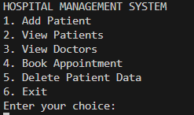
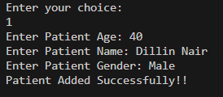
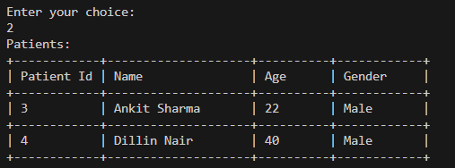
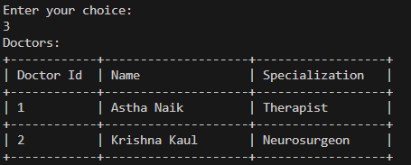
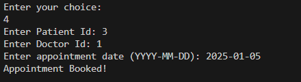
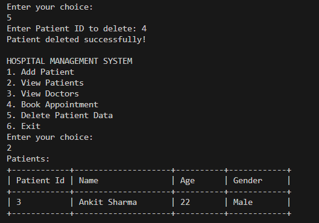

# 🏥 Hospital Management System

A simple **Java console-based** application using **JDBC** and **MySQL** to manage hospital operations like adding patients, viewing doctors, booking appointments, and more.

---

## 🔧 Features

1. ➕ Add Patient  
2. 📋 View Patients  
3. 🩺 View Doctors  
4. 📅 Book Appointment  
5. 🗑️ Delete Patient Data  
6. 🚪 Exit  

---

## 💻 Technologies Used

- Java
- JDBC
- MySQL
- VS Code

---

## 📸 Screenshots

### ▶️ Main Menu


### 🧑 Add Patient


### 📋 View Patients


### 🩺 View Doctors


### 📅 Book Appointment


### 🗑️ Delete Patient


---

## 🏁 How to Run

1. Clone the repository  
   ```bash
   git clone https://github.com/AnkkitShrma21/Hospital-Management-System.git
